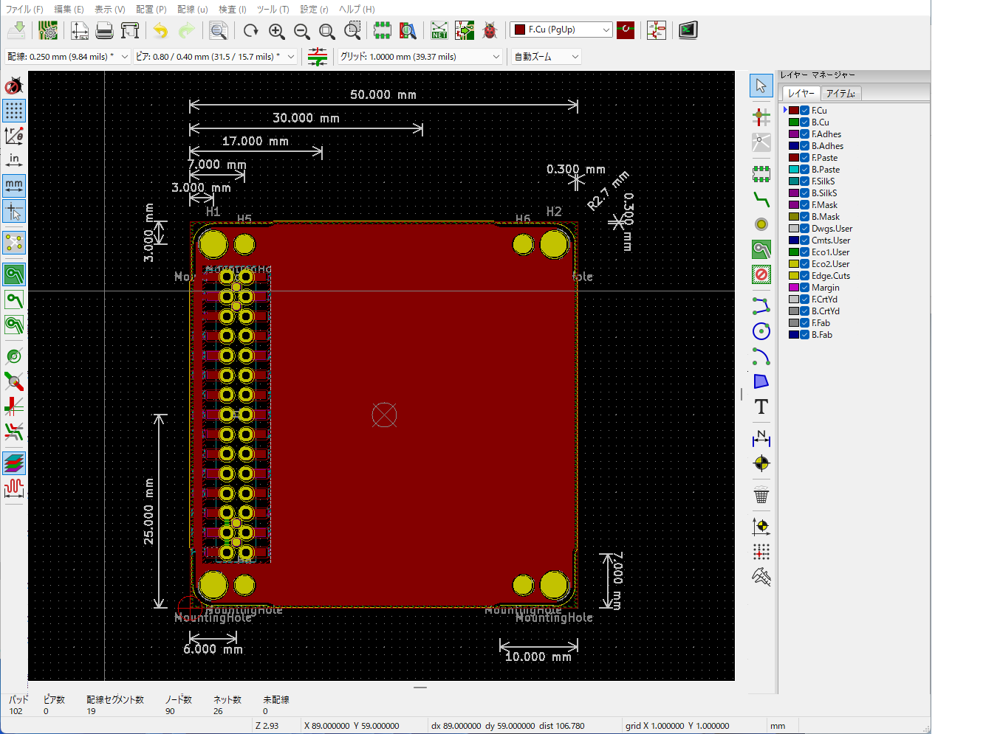

# KiCad-Template-M5Stack-FDM
a PCB template of FDM-modules of M5Stack with footprints for KiCad.

- FDM: Fused Deposition Modeling
- Manufacture with a thickness of 1.0 mm.
- M-BUS pin numbers match pin headers and pin sockets in the KiCad library.
- The template has a notch, but it may be actually needed only for the M5Stack controller board.

